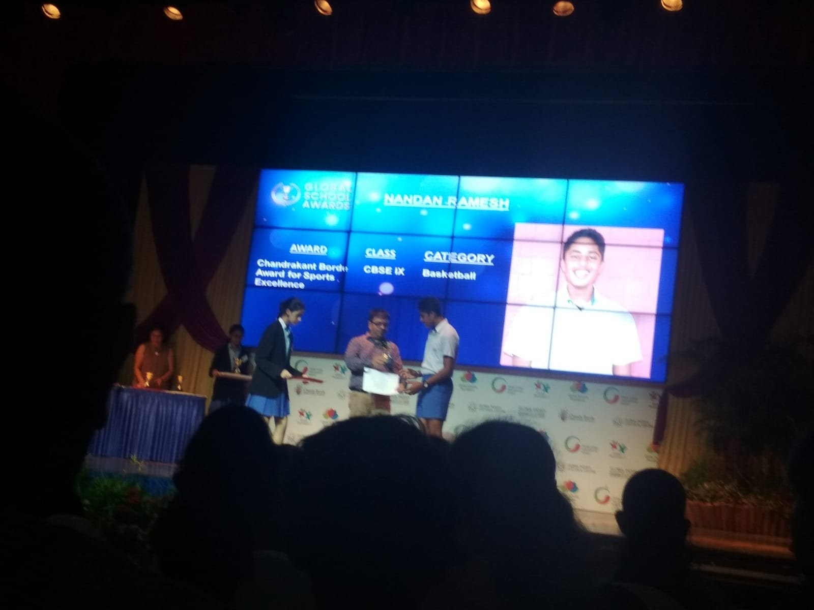
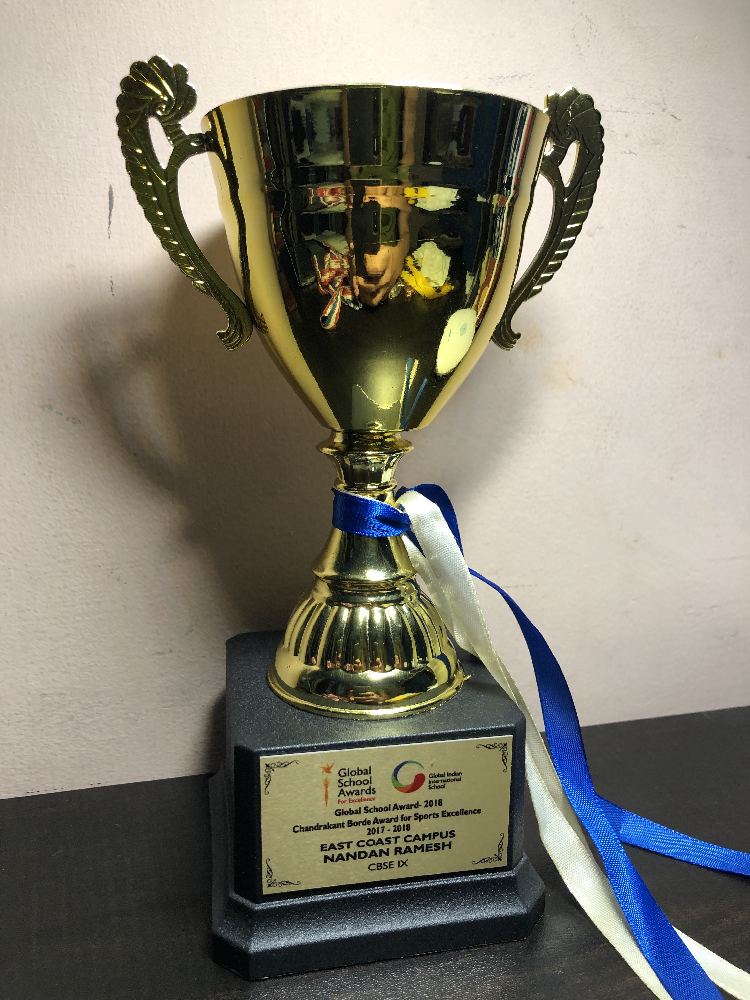
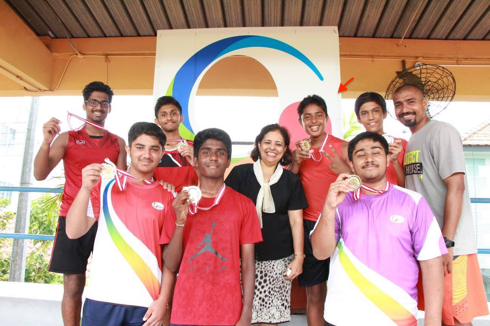
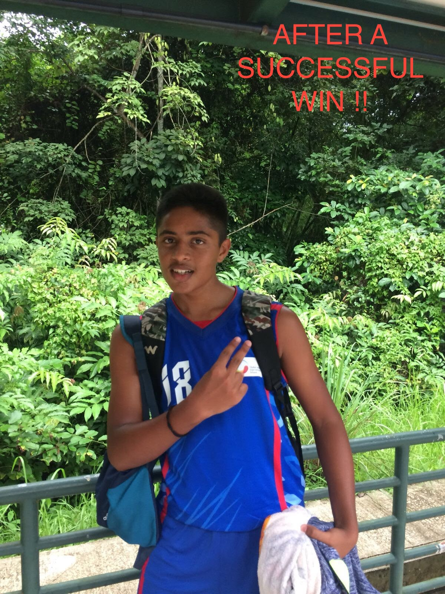
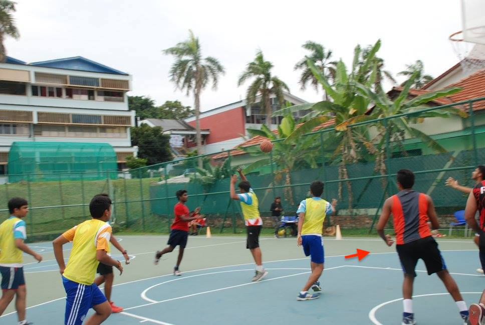
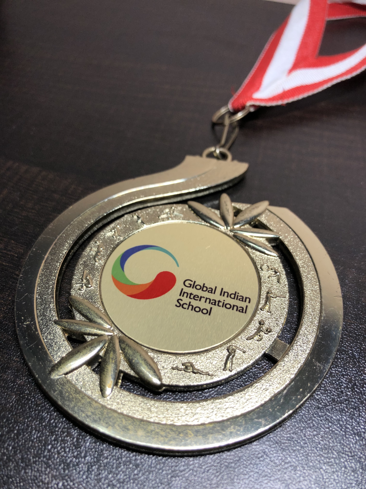
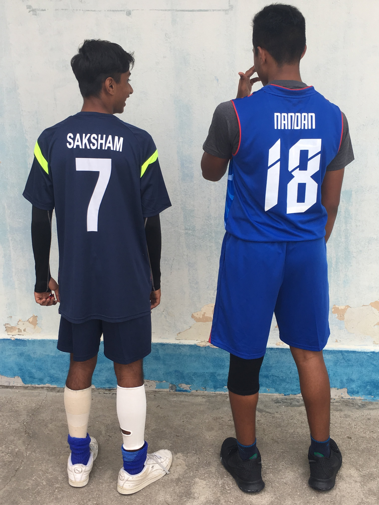
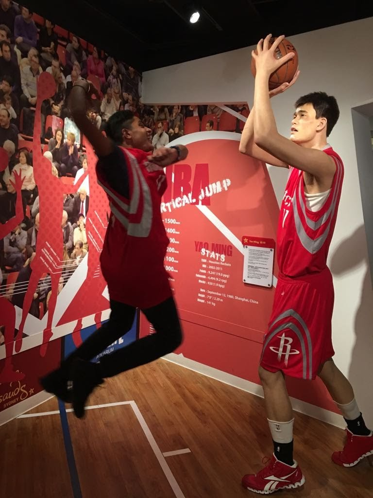

Basketball has been an integral part of me all my life ...

-[**Chandrakant Borde Award for Sports Excellence**](https://news.globalindianschool.org/global-schools/deserving-students-win-big-at-gsa-awards-2018)

-[**GIIS Sports Carnival**](https://www.facebook.com/GIIS.EastCoast.Singapore/photos/d41d8cd9/1487896087952701/)

Came 1st place

-[**ACSIS Tournaments**](https://www.acsis.sg/)

Came 4th place in the Division-2 League

http://sports.gess.sg/pu_MatchReport.asp?ID=28013&FID=2631022&SRC=P

-[**GIIS Gold Squad**](https://sg.globalindianschool.org/home/explore/gold-squad-programme)

-[**INTER-SCHOOL HOUSE CUP**](https://sg.globalindianschool.org/home/singapore-campuses/east-coast-campus)

Played a major role for my team 'Orchid' in winning 1st place for 2 consecutive years

-[**OFS (Overseas Family School) Annual Sports Meet**](https://www.ofs.edu.sg/news/)

Came 4th place after a 1-point playoff loss

-[**GIIS Punggol Fundraiser Tournament**](https://www.schoolofthefuture.sg/sports-performance-enhancing-data-analytics-system-spedas)

Came 3rd place at a fundraiser tournament organised at GIIS SMART Campus

- GALLERY

