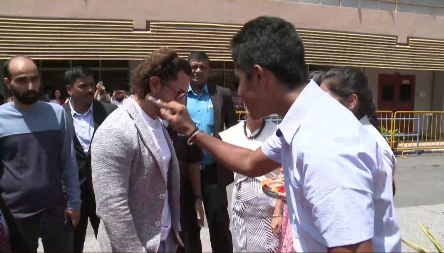
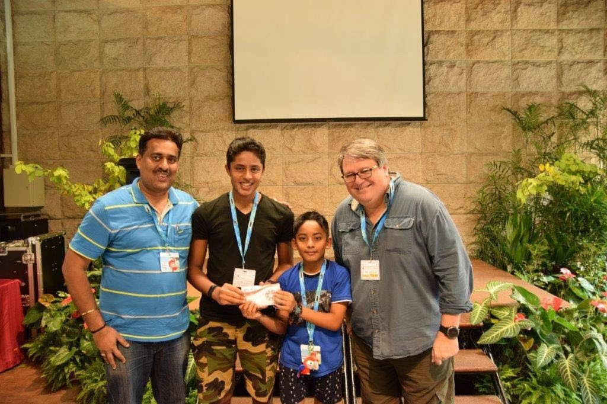
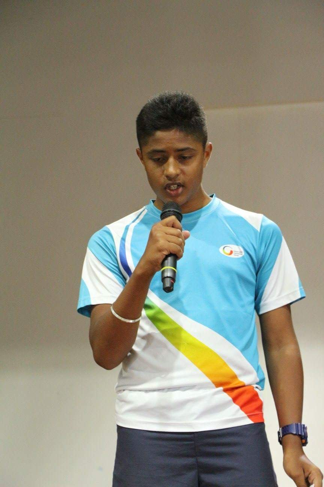
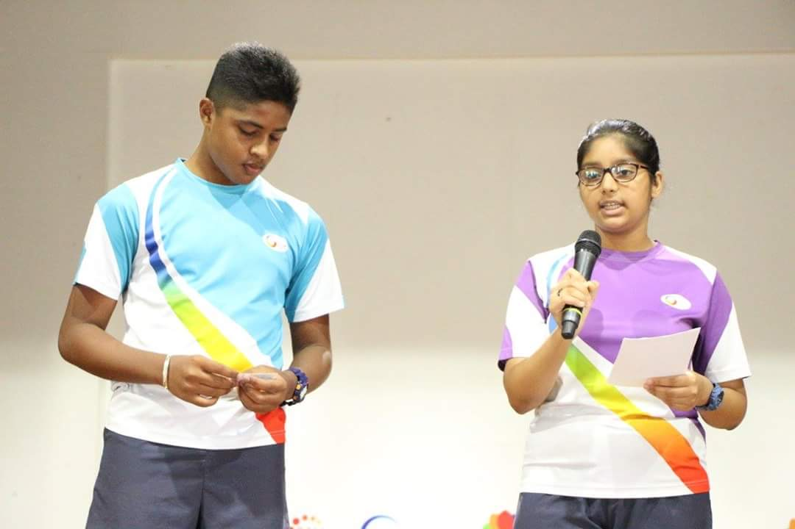
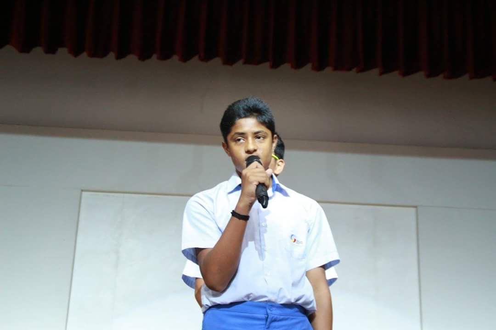
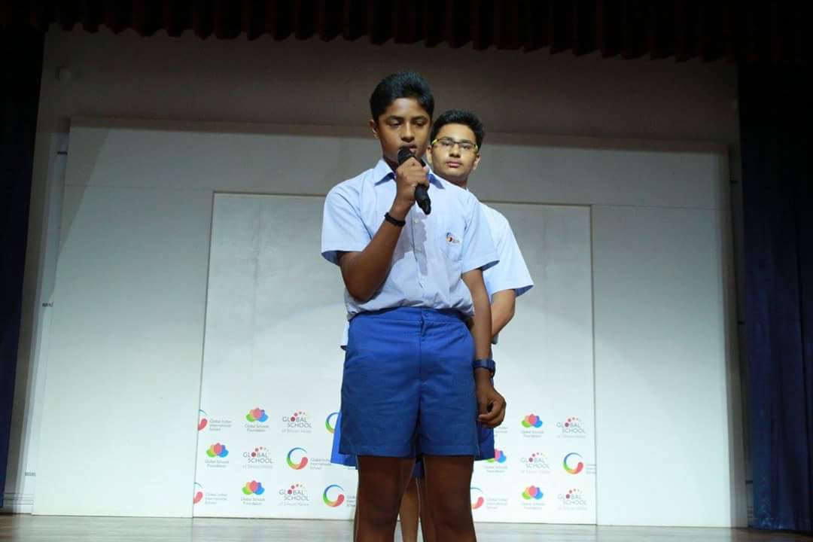
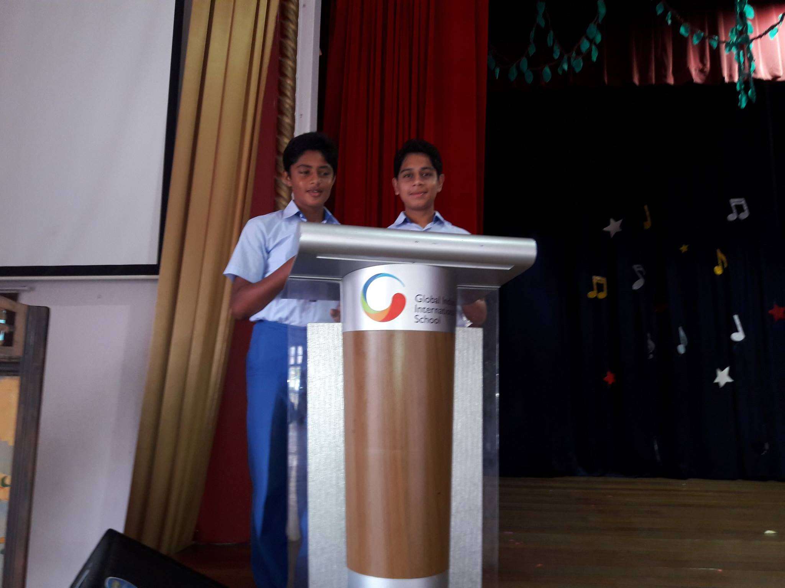

- Welcomed Mr.Aamir Khan for the Leadership Lecture Series Event



- Best Zoo Guide at [**Dimension Data**](https://www.dimensiondata.com/) Event,[**Singapore Zoo**](https://www.wrs.com.sg/en/singapore-zoo.html)

- Host at Tech Week, GIIS singapore

- Speaker for Innovative Ideas, GIIS singapore

- Presented Vote of Thanks @ Class Assembly

