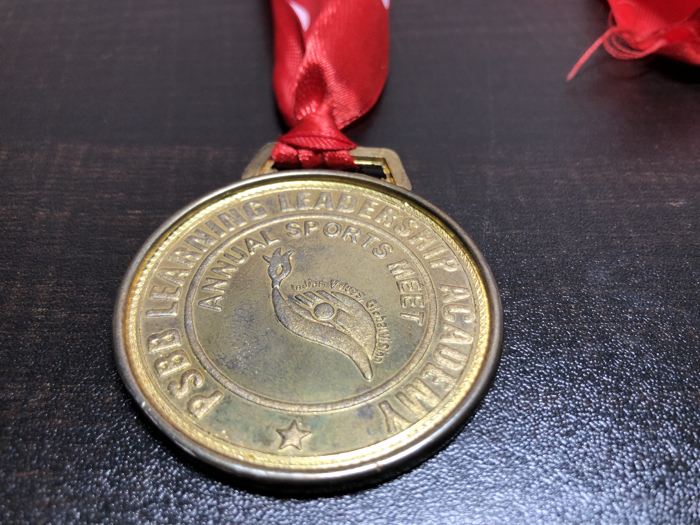
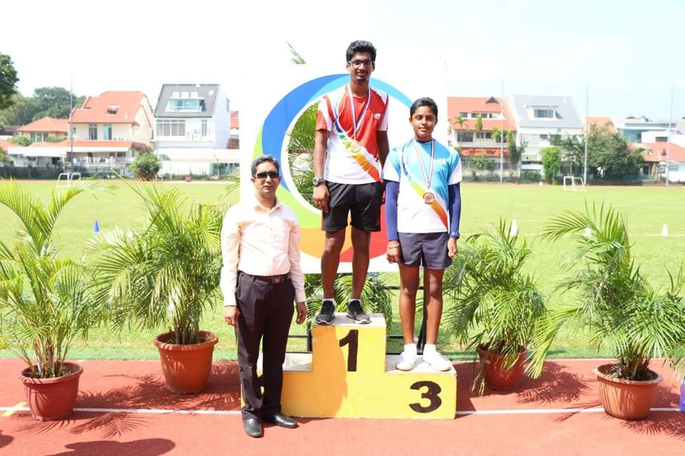
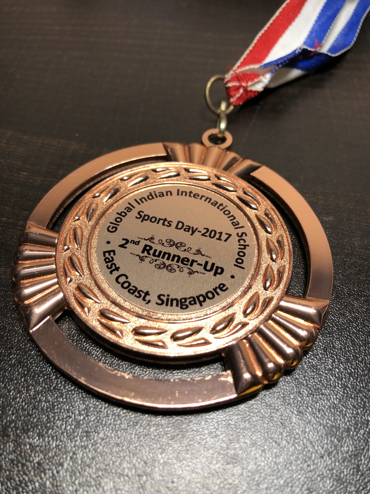

Evolving as a shot-putter

-[**SPRINT 2020 EVENT**](https://www.pressreader.com/india/the-hindu/20200201/282376926562112)

Came 4th place out of 50+ participants, setting a new school record in the U18 category



-[**PSBB ANNUAL SPORTS MEET**](https://www.psbbmillenniumschool.org/psbb-bengaluru/)

Came 1st place after 3 rounds of rigorous competition

-[**GIIS EAST COAST, ANNUAL SPORTS DAY**](https://www.youtube.com/watch?v=20p7-aZZxII&ab_channel=GlobalIndianInternationalSchool)

