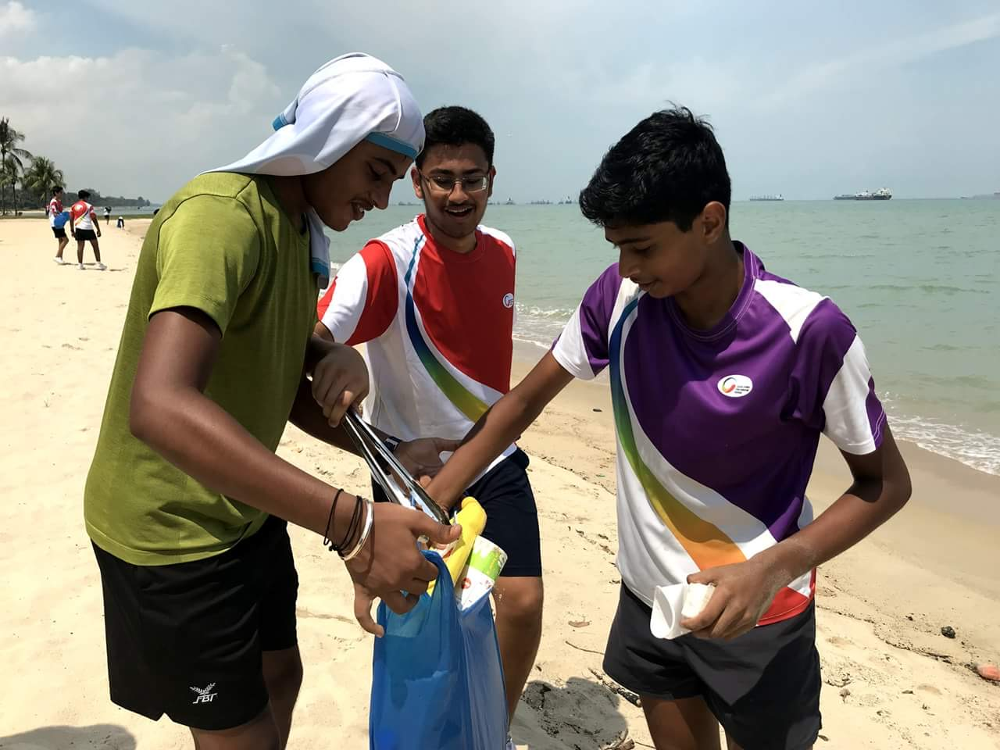
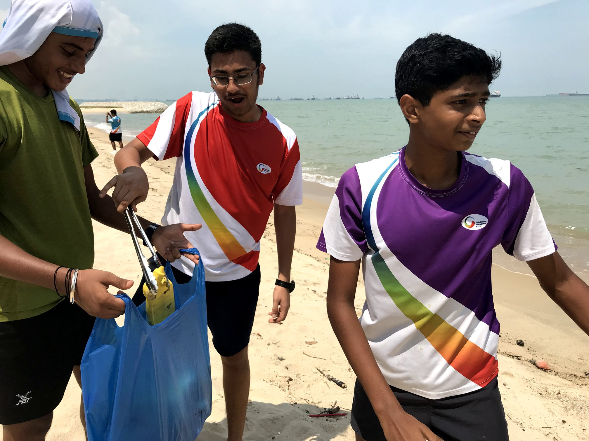
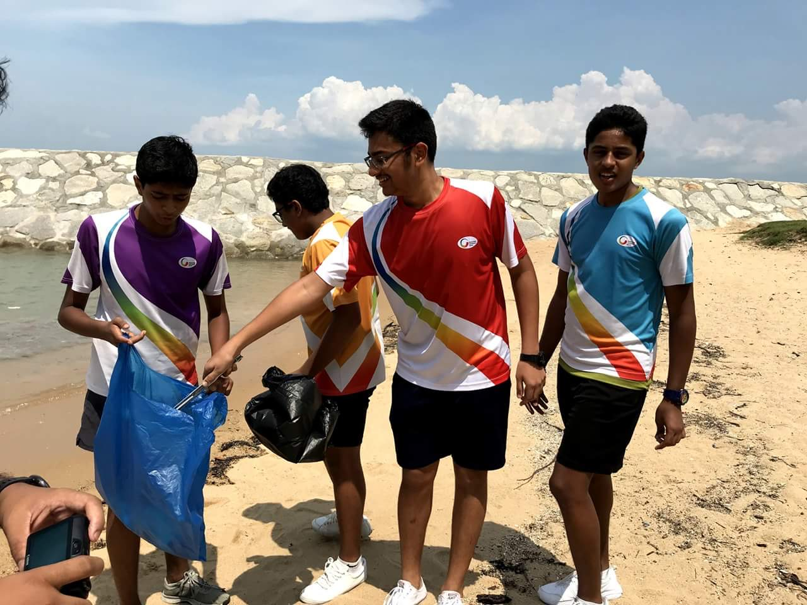
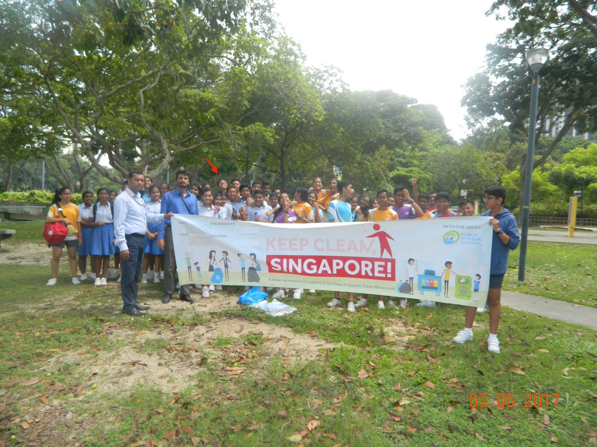

- Helped in cleaning up [**East Coast Beach**](https://www.nparks.gov.sg/gardens-parks-and-nature/parks-and-nature-reserves/east-coast-park) and cleared it of any unwanted trash,
as part of the [**Keep Clean, Singapore!**](https://www.publichygienecouncil.sg/about) Campaign  

- 2018

- 2017

