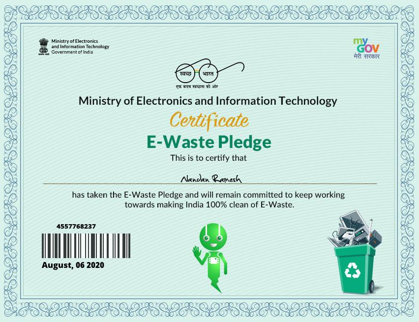

- Pledged to make India free of E-Waste by following various recycling methods.

- Helped in informing and guiding people to E-Waste bins in the society to promote recycling of E-Waste.

- Contributed by helping cleaners in segregating E-Waste from among other household Waste.
