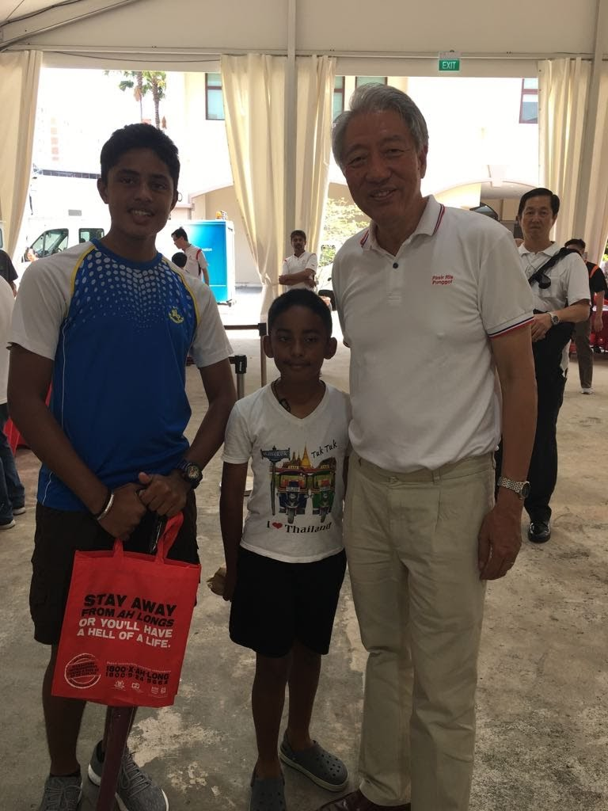
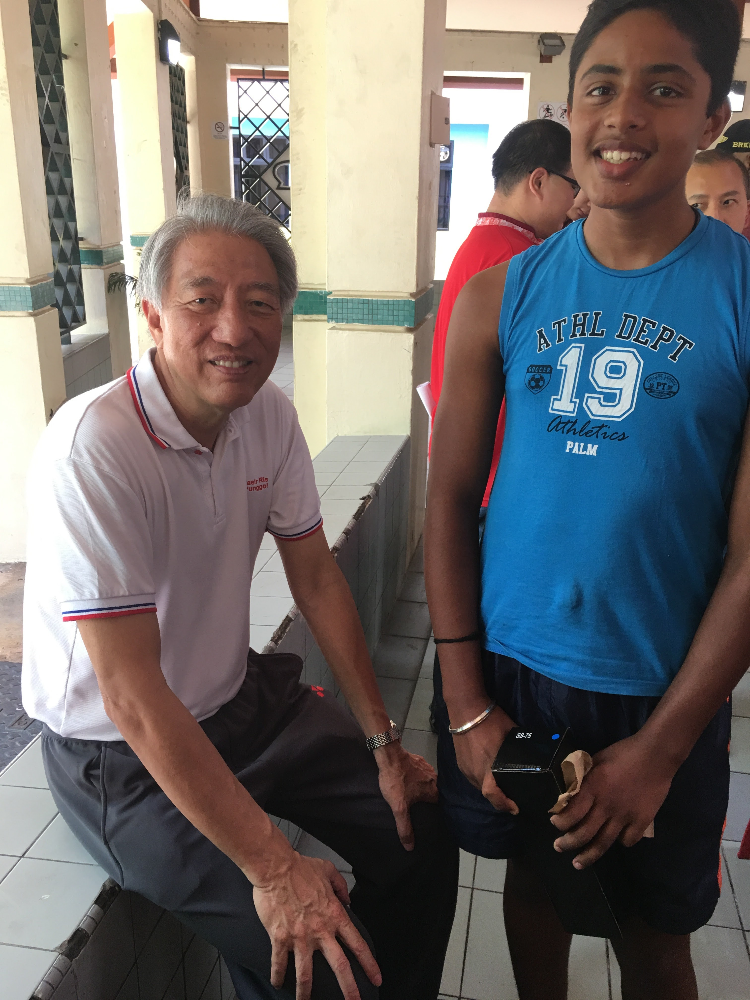

Recieved appreciation from Minister Mr.Teo Chee Hean for -

- An event to spread awareness on cyber-crime and cyber-safety.

 

- Helped in getting feedback from residents regarding renovations to the society.

