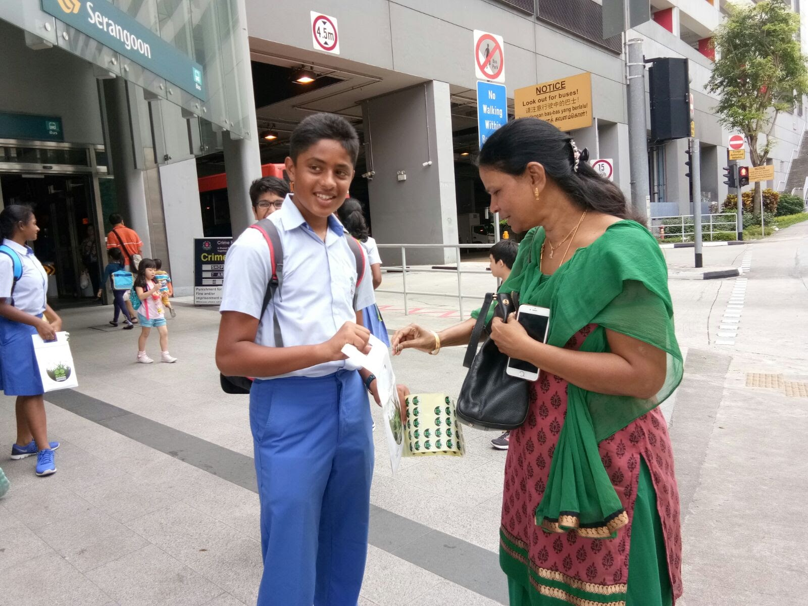

Volunteered by collecting donations from people in public locations, for [**RSVP Singapore**](https://rsvp.org.sg/), a Non-Profit Organization helping Elderly Citizens in receiving proper healthcare.

